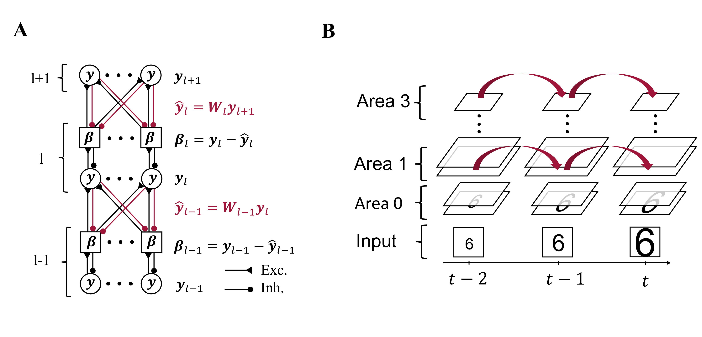

# PCInvariance

Train a **Hebbian Predictive Coding Network** on short sequences of moving objects. Both invariant representations and a generative model are learned.

This repository provides the code for the experiments in our paper:

Matthias Brucklacher*, Sander M. Bohte, Jorge F. Mejias, Cyriel M. A. Pennartz - [Local minimization of prediction errors drives learning of invariant object representations in a generative network model of visual perception] (https://www.biorxiv.org/content/10.1101/2022.07.18.500392v3)

&ast;Corresponding author. Email: m.m.brucklacher@uva.nl


## A brief introduction

The model consists of three hierarchical areas attempting to minimize reconstruction errors in inference and learning. While this is similar to other Predictive Coding networks (Rao & Ballard (1999), Dora et al. (2021)), the inputs here are sequences and not static images. Importantly, the network does *not* actively predict forward in time, activity in representation neurons simply carries over. 



Without externally provided labels, the network learns invariant representations that can be read out linearly. The increasing invariance across the network hierarchy is also mirrored in a slower timescale of activity updates in higher network areas.

## Dependencies
- [Python and Conda](https://www.anaconda.com/)
- Setup the conda environment `pcenv` by running:

    ```bash
    conda env create -f environment.yml
    ```

- With the activated environment, install the local package 'scripts' to allow absolute imports of modules. From directory 'PCInvariance', run:
    ```bash
    pip install -e .
    ```

### Troubleshooting
#### Problems with installation of the environment
- The small number of required packages makes it fast to create the conda environment from hand. 
- The necessary packages are listed in the file environment.yml

## **Usage**
- Activate the environment:
    ```bash
    source activate pcenv
    ```
- Run subsequent commands from directory 'scripts'.

### **Figure 4. Representations invariant to viewing conditions are learned without data labels.**
- Fig. 4a: 
    ```bash
    python train.py --data mnist_extended.npy --labels labels_mnist_extended.npy --trafos 0 0 0 --resultfolder fig4a --epochs 0
    python post_run_analysis/plot_rdm.py --simulation_id fig4a 
    ```

- Fig. 4b:
    ```bash
    python train.py --data mnist_extended.npy --labels labels_mnist_extended.npy --trafos 1 1 1 --resultfolder fig4b --epochs 20
    python post_run_analysis/plot_rdm.py --simulation_id fig4b
    ```

- Fig. 4c
    ```bash
    python train.py --data mnist_extended.npy --labels labels_mnist_extended.npy --trafos 0 0 0 --resultfolder fig4c --epochs 20
    python post_run_analysis/plot_rdm.py --simulation_id fig4c
    ```

- Fig. 4d
    ```bash
    python train.py --data mnist_extended.npy --labels labels_mnist_extended.npy --trafos 0 0 0 --noise_on 1 --resultfolder fig4d --epochs 20
    python post_run_analysis/plot_rdm.py --simulation_id fig4d
    ```

- Fig. 4e
    ```bash
    python train.py --data mnist_extended.npy --labels labels_mnist_extended.npy --trafos 2 2 2 --resultfolder fig4e --epochs 20
    python post_run_analysis/plot_rdm.py --simulation_id fig4e
    ```

- Fig. 4f
    ```bash
    python train.py --data smallnorb_extended.npy --labels smallnorb_labels.npy --trafos 0 0 0 --resultfolder fig4f --epochs 20
    python post_run_analysis/plot_rdm.py --simulation_id fig4f
    ```
### **Figure 5a-b. Area 3-representations encode object identity.**
- First, train networks:
    ```bash
    python train.py --data smallnorb_extended.npy --labels smallnorb_labels.npy --trafos 0 0 0 --resultfolder fig5a --epochs 20 --n_runs 4

    python train.py --data mnist_extended_fast.npy --labels labels_mnist_extended.npy --trafos 0 0 0 --resultfolder fig5b_trafo-0_static-0_noise-0 --epochs 20 --n_runs 4

    python train.py --data mnist_extended_fast.npy --labels labels_mnist_extended.npy --trafos 1 1 1 --resultfolder fig5b_trafo-1_static-0_noise-0 --epochs 20 --n_runs 4

    python train.py --data mnist_extended_fast.npy --labels labels_mnist_extended.npy --trafos 2 2 2 --resultfolder fig5b_trafo-2_static-0_noise-0 --epochs 20 --n_runs 4

    python train.py --data mnist_extended_fast.npy --labels labels_mnist_extended.npy --trafos 0 0 0 --resultfolder fig5b_trafo-0_static-1_noise-0 --do_train_static 1 --epochs 20 --n_runs 4

    python train.py --data mnist_extended_fast.npy --labels labels_mnist_extended.npy --trafos 1 1 1 --resultfolder fig5b_trafo-1_static-1_noise-0 --do_train_static 1 --epochs 20 --n_runs 4

    python train.py --data mnist_extended_fast.npy --labels labels_mnist_extended.npy --trafos 2 2 2 --resultfolder fig5b_trafo-2_static-1_noise-0 --do_train_static 1 --epochs 20 --n_runs 4
    ```
- Then plot:
    ```bash
    python post_run_analysis/plot_fig5ab.py 
    ```

### **Figure 5c-d. Area 3-representations encode object identity (Part II).**
- Train networks with standard architecture and with an increased number of neurons. To generate all necessary training runs, replace *n_ipc*, the number of instances per class in the training data, below with [1, 5, 10, 15, 20].
    ```bash
        python train.py --data mnist_extended_fast.npy --labels labels_mnist_extended.npy --trafos 0 0 0 --resultfolder fig5cd_arch-[2000-500-30]_nipc-<n_ipc> --epochs 20 --n_runs 4 --use_validation_data 1 --n_instances_per_class_train <n_ipc>
    ```
    ```bash
        python train.py --data mnist_extended_fast.npy --labels labels_mnist_extended.npy --trafos 0 0 0 --resultfolder fig5cd_arch-[4000-2000-90]_nipc-<n_ipc> --epochs 20 --n_runs 4 --use_validation_data 1 --n_instances_per_class_train <n_ipc>
    ```
- Then, compute baselines and plot.
    ```bash
    python post_run_analysis/plot_fig5cd.py 
    ```

### **Figure 6. The network develops a hierarchy of timescales comparable to experimental data from rodent visual cortex.**
- Compute autocorrelations
    ```bash
        python post_run_analysis/autocorrelation_compute.py
    ```
     
- Run statistical analysis and plot autocorrelation decay
    ```bash
        python post_run_analysis/autocorrelation_analyze.py
    ```


### Figure 7b. Learning of a generative model (Part II). 
- First, train networks:
    ```bash
    python train.py --data mnist_extended_fast.npy --labels labels_mnist_extended.npy --trafos 0 0 0 --resultfolder fig7b_translation --epochs 20 --n_runs 4
    python train.py --data mnist_extended_fast.npy --labels labels_mnist_extended.npy --trafos 1 1 1 --resultfolder fig7b_rotation --epochs 20 --n_runs 4
    python train.py --data mnist_extended_fast.npy --labels labels_mnist_extended.npy --trafos 2 2 2 --resultfolder fig7b_scaling --epochs 20 --n_runs 4
    ```
- Then
    ```bash
    python post_run_analysis/plot_fig7b.py --simulation_id_1 fig7b_translation --simulation_id_2 fig7b_rotation --simulation_id_3 fig7b_scaling
    ```
<!--
### **Figure 8. Reconstruction of partially occluded sequences.**
-->